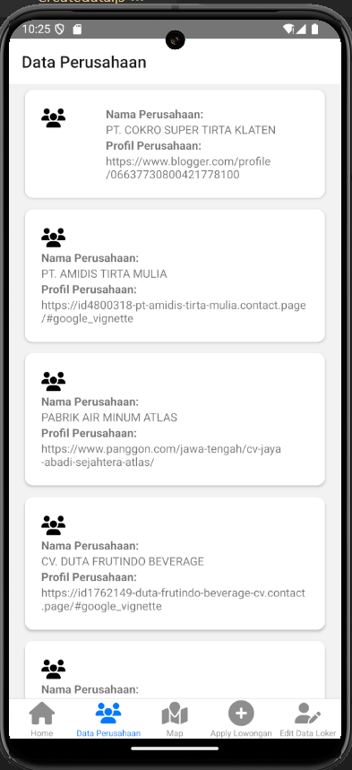

# JobFinder Jawa Tengah

## Deskripsi Produk

**JobFinder Jawa Tengah** adalah aplikasi React Native yang dirancang untuk memudahkan pencarian pekerjaan dan pendaftaran kerja bagi masyarakat di Jawa Tengah. Aplikasi ini menyediakan daftar perusahaan beserta profilnya, lengkap dengan fitur peta interaktif untuk menunjukkan lokasi sebaran perusahaan di wilayah tersebut. Pengguna dapat mendaftar pekerjaan melalui fitur Apply Lowongan dan memperbarui data melalui fitur Edit Data.

## Komponen Pembangun Produk

- **React Native**: Framework utama untuk membangun aplikasi lintas platform dengan performa tinggi.
- **React Navigation**: Digunakan untuk mengatur navigasi antar layar dalam aplikasi.
- **Leaflet.js**: Library untuk menampilkan peta interaktif dengan lokasi perusahaan.
- **JSON SERVER**: Database lokal untuk menyimpan data perusahaan dan informasi pelamar.


## Fitur Utama

- **Landing Page**: Halaman awal aplikasi yang berisi pengenalan tentang JobFinder Jawa Tengah.
- **Daftar Perusahaan**: Menampilkan daftar perusahaan di Jawa Tengah, lengkap dengan tautan ke profil masing-masing perusahaan.
- **Peta Lokasi Perusahaan**: Peta interaktif yang menunjukkan sebaran lokasi perusahaan di wilayah Jawa Tengah.
- **Apply Lowongan**: Fitur untuk mendaftar pekerjaan dengan mengisi formulir informasi pribadi seperti nama, email, dan nomor telepon.
- **Edit Data**: Fitur untuk memperbarui informasi pendaftaran pekerjaan, termasuk mengoreksi kesalahan input atau menghapus data.

## Sumber Data

- Profil perusahaan dan lokasi diambil dari berbagai sumber seperti Google Maps dan Website profil masing-masing perusahaab.

## Tangkapan Layar Komponen Penting

1. **Landing Page**
   

2. **Daftar Perusahaan**
   

3. **Peta Lokasi Perusahaan**
   

4. **Apply Lowongan**
   

5. **Edit Data**
   

## Cara Menjalankan Aplikasi

1. **Clone repositori ini**:
   ```bash
   git clone https://github.com/username/jobfinder-jawa-tengah.git
   cd jobfinder-jawa-tengah
   ```

2. **Instal dependensi**:
   ```bash
   npm install
   ```

3. **Jalankan aplikasi** (menggunakan Expo):
   ```bash
   npx expo start
   ```

4. **Lihat aplikasi di perangkat atau emulator**:
   - Gunakan aplikasi Expo Go di perangkat Anda.
   - Atau gunakan emulator Android/iOS yang telah dikonfigurasi.


